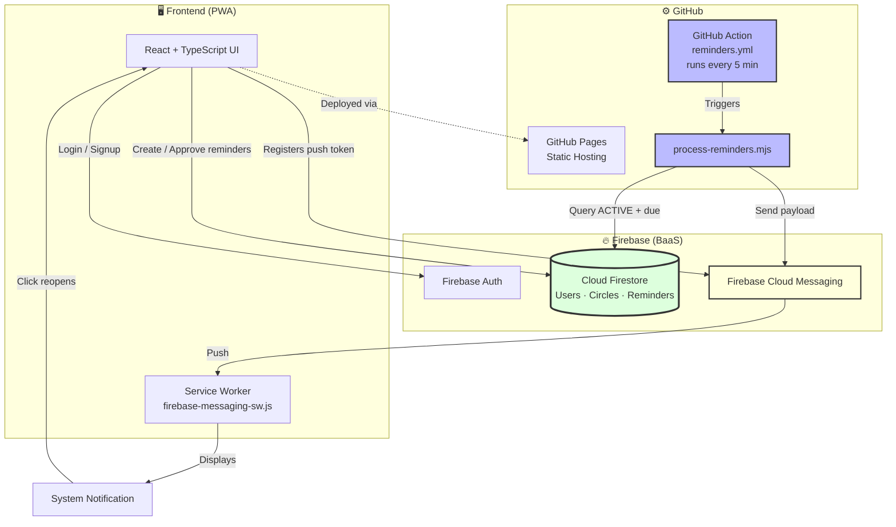
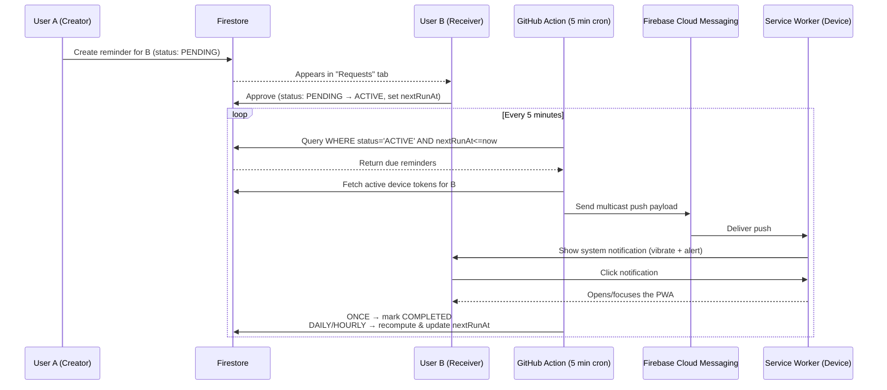

# 💌 Kuchu-Puchu: Friend Reminder

**Kuchu-Puchu** is a tiny, private reminder ecosystem designed for intimate circles of up to five people. Unlike generic reminder apps, Kuchu-Puchu is built on the principle of **consent and kindness** — allowing friends to leave gentle nudges for one another that must be accepted before they become active.

> 💌 A private, consent-based reminder PWA for tiny circles of friends. Built with React, Firebase, and GitHub Actions to deliver serverless push notifications.

---

## 🌟 Core Philosophy & Why It Exists

Most reminder apps are solo tools built for a noisy world of intrusive notifications. **Kuchu-Puchu** is a social tool built for a "safe space" — a small group of people supporting each other.

By implementing **consent-based logic** and capping circles at 5 people, the app transforms a utility tool into a gesture of care. If you want to remind a friend to drink water, take a break, or remember an important date, the app ensures the reminder is *welcomed and requested*, not spammed.

- Remind **yourself** → active immediately.
- Remind a **friend** → sent as a **Request**. They must **Approve** it before it can ever notify them.

## ✨ Features

- **Private Circles:** Create a secure circle or join one via a unique invite code (max 5 members).
- **Consent-Based Reminders:** Requests must be explicitly accepted before they go live.
- **Flexible Scheduling:** One-time events, daily habits, or custom hourly intervals (1–12 hours).
- **PWA Experience:** Installable on iOS and Android, behaving like a native app with a standalone interface.
- **Multi-Device Push:** Notifications delivered across all logged-in devices via Firebase Cloud Messaging (FCM).
- **Member Management:** The circle owner generates invite codes to fill the circle.

---

## 🏗 High-Level Design (HLD)

Kuchu-Puchu uses a **serverless, event-driven architecture**. Instead of maintaining a costly always-on server, it uses GitHub Actions as a distributed cron-job engine and Firebase as the database and notification hub.

### System Architecture Diagram



### How Everything Is Connected

1. **Frontend (The Interface):** A React PWA hosted on **GitHub Pages** — handles auth, reminder creation, and push-token registration.
2. **Database (The Brain):** **Firestore** stores user profiles, circle memberships, and the reminder queue.
3. **The Trigger (The Clock):** A **GitHub Action** (`reminders.yml`) wakes up every 5 minutes.
4. **The Processor (The Engine):** The Action runs `process-reminders.mjs`, querying Firestore for reminders where `status == 'ACTIVE'` and `nextRunAt <= now`.
5. **The Delivery (The Messenger):** The processor sends a payload to **FCM**, which pushes to the user's browser/device.
6. **The Receiver (The Worker):** The **Service Worker** (`firebase-messaging-sw.js`) listens in the background and displays the notification even if the app is closed.

---

## 🔁 Data Flow — "Life of a Reminder"



### Step by step

1. **Creation** — User A creates a reminder for User B → saved in Firestore as `PENDING`.
2. **Consent** — User B sees the request in the "Requests" tab → clicks **Accept** → status becomes `ACTIVE`.
3. **Scheduling** — The app computes `nextRunAt` based on the chosen frequency (e.g. `EVERY_3_HOURS`).
4. **Detection** — Every 5 minutes, the GitHub Action runs → finds this reminder → checks if it's due.
5. **Dispatch** — The script fetches all active device tokens for User B → sends the push via FCM.
6. **Notification** — User B's device receives the push → Service Worker triggers a vibration/alert → clicking it opens the app.
7. **Update** — The script computes the next occurrence and updates `nextRunAt` (or marks the reminder `COMPLETED` if it was one-time).

---

## 🛠 Tech Stack

| Layer | Technology | Purpose |
| :--- | :--- | :--- |
| **Frontend** | `React` + `TypeScript` | UI logic and type safety |
| **Build Tool** | `Vite` | Fast bundling, HMR, and PWA routing |
| **Styling** | `CSS3` (Custom) | Soft, pastel "kindness" aesthetic |
| **Backend/BaaS** | `Firebase` | Auth, Firestore, Cloud Messaging (FCM) |
| **Automation** | `GitHub Actions` | Serverless cron jobs & CI/CD |
| **Deployment** | `GitHub Pages` | Static site hosting |
| **PWA** | `Web Manifest` + Service Worker | Installability and background push |

---

## 🚀 Setup & Deployment

### Prerequisites
- A Firebase project.
- A GitHub repository.

### 🔑 Secrets Configuration
Add the following as **GitHub Actions Secrets**:

- `VITE_FIREBASE_API_KEY`
- `VITE_FIREBASE_AUTH_DOMAIN`
- `VITE_FIREBASE_PROJECT_ID`
- `VITE_FIREBASE_STORAGE_BUCKET`
- `VITE_FIREBASE_MESSAGING_SENDER_ID`
- `VITE_FIREBASE_APP_ID`
- `VITE_FIREBASE_VAPID_KEY`
- `FIREBASE_SERVICE_ACCOUNT_JSON` (full JSON key for the service account)

### 🛠 Local Development
```bash
git clone <your-repo-url>
cd kuchu-puchu
npm install
# create a .env file with the variables listed above
npm run dev
```

### 🚢 Deployment
The project is configured for **GitHub Pages**. Push to `main` and the `deploy.yml` workflow will:

1. Generate the dynamic Service Worker using `generate-firebase-sw.mjs`.
2. Build the Vite project.
3. Deploy the `dist` folder to GitHub Pages (`/kuchu-puchu/`).

### 📊 Database Indexing
Deploy the composite index found in `firebase.indexes.json` to your Firestore instance so the reminder engine can efficiently query due reminders:

```bash
firebase deploy --only firestore:indexes
```

---

## 📜 License
Distributed under the MIT License. See `LICENSE` for more information.
